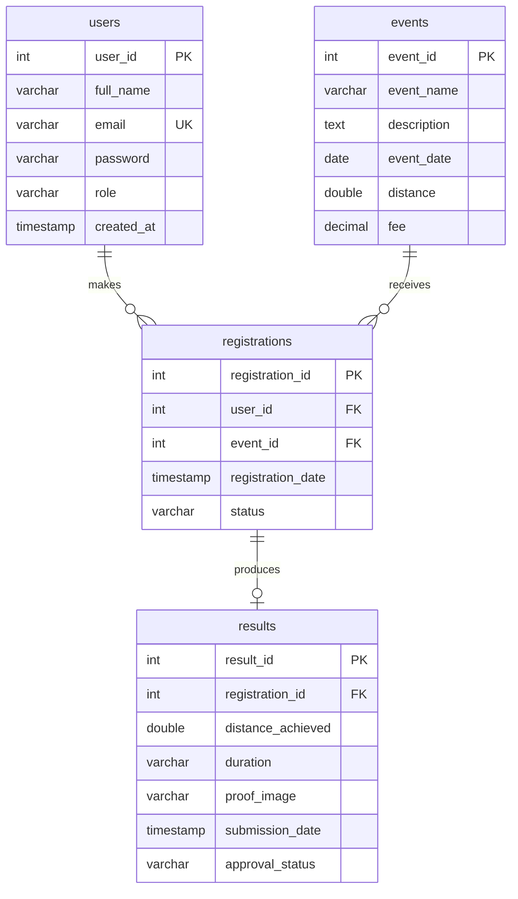

# Uni-Run Database Design

Design documentation for the `unirun_db` database: the entity relationship
diagram, a full data dictionary, the referential integrity rules, and the
normalisation analysis.

Every type, default and constraint recorded here was read from the running
database rather than from the setup script, so this document describes the
schema as it actually exists.

- **Database:** `unirun_db`
- **Engine:** InnoDB
- **Character set:** `utf8mb4`, collation `utf8mb4_general_ci`

InnoDB is used because it is the only common MySQL engine that enforces
foreign keys, which this design depends on.

---

## 1. Entity Relationship Diagram



### Relationships

| Relationship | Cardinality | Meaning |
|---|---|---|
| `users` → `registrations` | One to many | A participant may join many events; each registration belongs to exactly one participant |
| `events` → `registrations` | One to many | An event may receive many registrations; each registration is for exactly one event |
| `registrations` → `results` | One to zero-or-one | A registration may have one submitted result, or none yet |

A participant may join many events, and an event may be joined by many
participants. That is a many to many relationship, which cannot be stored
directly in a relational table. `registrations` is the **associative entity**
that resolves it, holding the two foreign keys plus the facts that belong to
the pairing itself, namely when the registration happened and its status.

The link from `registrations` to `results` is one to *at most* one. A
participant registers first and submits a result later, so a registration
exists for a period with no result attached. This is enforced by a unique key
on `results.registration_id`.

---

## 2. Data Dictionary

### 2.1 `users`

Accounts for both participants and administrators.

| Column | Type | Null | Key | Default | Description |
|---|---|---|---|---|---|
| `user_id` | INT(11) | No | PK | AUTO_INCREMENT | Surrogate primary key |
| `full_name` | VARCHAR(100) | No | | none | Participant's full name as displayed on dashboards, the leaderboard and certificates |
| `email` | VARCHAR(100) | No | UK | none | Login identifier. Unique, so no two accounts share an address |
| `password` | VARCHAR(100) | No | | none | SHA-256 digest of the password as 64 hexadecimal characters. Plain text is never stored |
| `role` | VARCHAR(20) | No | | `'participant'` | Either `admin` or `participant`. Determines which dashboard the user reaches after login and which pages they may open |
| `created_at` | TIMESTAMP | No | | `current_timestamp()` | When the account was created |

**Note on `password` length.** A SHA-256 digest is always 64 characters, so
VARCHAR(100) leaves headroom for a future move to a longer format such as
bcrypt without a schema change.

### 2.2 `events`

The marathon and virtual run events available to join.

| Column | Type | Null | Key | Default | Description |
|---|---|---|---|---|---|
| `event_id` | INT(11) | No | PK | AUTO_INCREMENT | Surrogate primary key |
| `event_name` | VARCHAR(255) | No | | none | Display name of the event |
| `description` | TEXT | Yes | | NULL | Longer description shown on the events page |
| `event_date` | DATE | Yes | | NULL | Date the event takes place |
| `distance` | DOUBLE | No | | none | Official distance in kilometres |
| `fee` | DECIMAL(10,2) | Yes | | `0.00` | Entry fee in Ringgit. Zero for free events |

**Note on `fee`.** DECIMAL is used rather than DOUBLE because money must be
exact. A binary floating point type cannot represent values such as 0.10
precisely, which causes rounding errors in totals.

### 2.3 `registrations`

The associative entity linking a participant to an event.

| Column | Type | Null | Key | Default | Description |
|---|---|---|---|---|---|
| `registration_id` | INT(11) | No | PK | AUTO_INCREMENT | Surrogate primary key |
| `user_id` | INT(11) | No | FK, UK* | none | The participant, referencing `users.user_id` |
| `event_id` | INT(11) | No | FK, UK* | none | The event, referencing `events.event_id` |
| `registration_date` | TIMESTAMP | No | | `current_timestamp()` | When the participant joined |
| `status` | VARCHAR(50) | Yes | | `'Pending'` | Registration state. The application writes `Registered` on a successful join |

\* `user_id` and `event_id` together form the composite unique key
`uq_registration_user_event`, so the same participant cannot join the same
event twice.

### 2.4 `results`

A submitted race result awaiting or having received a decision.

| Column | Type | Null | Key | Default | Description |
|---|---|---|---|---|---|
| `result_id` | INT(11) | No | PK | AUTO_INCREMENT | Surrogate primary key |
| `registration_id` | INT(11) | No | FK, UK | none | The registration this result belongs to, referencing `registrations.registration_id`. Unique, so one registration holds at most one result |
| `distance_achieved` | DOUBLE | No | | none | Distance the participant actually completed, in kilometres |
| `duration` | VARCHAR(100) | Yes | | NULL | Finish time recorded as `hh:mm:ss` |
| `proof_image` | VARCHAR(255) | Yes | | NULL | Server generated filename of the uploaded proof image. The file itself is stored outside the application |
| `submission_date` | TIMESTAMP | No | | `current_timestamp()` | When the result was submitted. Reset when a rejected result is resubmitted |
| `approval_status` | VARCHAR(50) | Yes | | `'Pending'` | `Pending`, `Approved` or `Rejected` |

---

## 3. Constraints and Referential Integrity

### 3.1 Keys

| Constraint | Type | Table | Columns | Purpose |
|---|---|---|---|---|
| `PRIMARY` | Primary key | users | `user_id` | Row identity |
| `uq_users_email` | Unique | users | `email` | One account per email address |
| `PRIMARY` | Primary key | events | `event_id` | Row identity |
| `PRIMARY` | Primary key | registrations | `registration_id` | Row identity |
| `uq_registration_user_event` | Unique | registrations | `user_id`, `event_id` | Prevents duplicate registrations |
| `fk_registrations_user` | Foreign key | registrations | `user_id` → `users.user_id` | Every registration belongs to a real user |
| `fk_registrations_event` | Foreign key | registrations | `event_id` → `events.event_id` | Every registration belongs to a real event |
| `PRIMARY` | Primary key | results | `result_id` | Row identity |
| `uq_results_registration` | Unique | results | `registration_id` | One result per registration |
| `fk_results_registration` | Foreign key | results | `registration_id` → `registrations.registration_id` | Every result belongs to a real registration |

### 3.2 Deletion behaviour

All three foreign keys are declared `ON DELETE CASCADE`.

| Action | Effect |
|---|---|
| Delete a user | Their registrations are removed, and the results beneath those registrations are removed with them |
| Delete an event | Its registrations are removed, and their results with them |
| Delete a registration | Its result is removed |

This guarantees no orphan rows can exist: there can never be a registration
pointing at a user who no longer exists, nor a result belonging to no
registration.

**Why cascade rather than restrict.** The alternative, `ON DELETE RESTRICT`,
would refuse to delete an event that has registrations. For this system that
would mean an administrator could never remove an event once a single person
had joined it, which is not useful behaviour. Cascade was chosen deliberately,
and the interface warns before deleting that dependent records will go too.

---

## 4. Normalisation

Normalisation removes redundancy so that a fact is stored in exactly one
place. Storing a fact twice allows the two copies to disagree, which is the
source of update, insertion and deletion anomalies.

### 4.1 Functional dependencies

**users**
```
user_id → full_name, email, password, role, created_at
email   → user_id, full_name, password, role, created_at
```
`email` is unique, so it also determines every other attribute. The table
therefore has two candidate keys: `user_id` and `email`.

**events**
```
event_id → event_name, description, event_date, distance, fee
```

**registrations**
```
registration_id     → user_id, event_id, registration_date, status
(user_id, event_id) → registration_id, registration_date, status
```
The composite unique key makes `(user_id, event_id)` a second candidate key.

**results**
```
result_id       → registration_id, distance_achieved, duration, proof_image,
                  submission_date, approval_status
registration_id → result_id, distance_achieved, duration, proof_image,
                  submission_date, approval_status
```
`registration_id` is unique, making it a second candidate key.

### 4.2 First Normal Form

> A table is in 1NF when every column holds a single atomic value, there are no
> repeating groups, and every row is uniquely identifiable.

All four tables satisfy this. Each column holds one value, no column stores a
list, and every table has a primary key.

This is worth stating explicitly because the obvious alternative design fails
it. Recording a participant's events as a comma separated list inside the
`users` table, for example `events_joined = "1,3,5"`, would break 1NF
immediately and make it impossible to store a registration date per event.
`registrations` exists precisely to avoid that.

### 4.3 Second Normal Form

> A table is in 2NF when it is in 1NF and every non-key attribute depends on
> the *whole* primary key, not merely part of it.

Partial dependency is only possible when the primary key is composite. Every
table here uses a single column surrogate primary key, so no partial
dependency can exist and all four tables are in 2NF.

`registrations` deserves a closer look, since it is the table where this
normally goes wrong. Had the primary key been the composite
`(user_id, event_id)`, 2NF would require `registration_date` and `status` to
depend on both columns together. They do: the date is when *this participant*
joined *this event*, which is meaningless without both. So the table is in 2NF
under either choice of key.

A design that failed 2NF would be one storing `event_name` inside
`registrations`. That attribute depends on `event_id` alone, not on the pairing,
so it would be a partial dependency. It is correctly left in `events`.

### 4.4 Third Normal Form

> A table is in 3NF when it is in 2NF and no non-key attribute depends on
> another non-key attribute.

All four tables satisfy this.

- **users** — `full_name`, `password`, `role` and `created_at` each describe
  the account identified by `user_id`. None determines another.
- **events** — every attribute describes that event only.
- **registrations** — `registration_date` and `status` describe the
  registration itself, and neither determines the other.
- **results** — the measurements, the proof filename and the approval status
  all describe that one submission independently.

A design that failed 3NF would store `participant_name` in `results`. That
attribute would depend on `registration_id`, which leads to `user_id`, which
determines the name: a transitive dependency. Renaming a participant would
then require updating every result row, and missing one would leave the
database contradicting itself. The system instead joins to `users` whenever a
name is displayed, so the name exists in exactly one place.

### 4.5 Boyce-Codd Normal Form

> A table is in BCNF when every determinant is a candidate key.

All four tables also satisfy BCNF. As listed in 4.1, `users` is determined by
`user_id` or `email`, `registrations` by `registration_id` or
`(user_id, event_id)`, and `results` by `result_id` or `registration_id`. In
each case every determinant is itself a candidate key, so no BCNF violation
exists.

### 4.6 Summary

| Table | 1NF | 2NF | 3NF | BCNF |
|---|:---:|:---:|:---:|:---:|
| `users` | Yes | Yes | Yes | Yes |
| `events` | Yes | Yes | Yes | Yes |
| `registrations` | Yes | Yes | Yes | Yes |
| `results` | Yes | Yes | Yes | Yes |

---

## 5. Design Decisions and Trade-offs

These are deliberate choices rather than oversights, recorded here so they can
be discussed rather than defended on the spot.

### 5.1 Surrogate primary keys

Every table uses an auto-incrementing integer key rather than a natural key
such as `email`. Natural keys change: a participant may update their email
address, and that change would then have to propagate to every referencing
row. A surrogate key never changes, so foreign keys stay stable. The natural
uniqueness of `email` is still enforced, by a unique constraint rather than by
the primary key.

### 5.2 A separate `results` table rather than columns on `registrations`

The relationship is one to at most one, so the result columns could have been
added to `registrations` directly. They were kept separate because a
registration normally exists for some time with no result, which would leave
six columns NULL on every unsubmitted row. Separating them keeps
`registrations` meaningful on its own and makes "has this person submitted
yet?" a question about whether a row exists rather than whether columns are
null.

### 5.3 `duration` stored as VARCHAR

The finish time is stored as text in `hh:mm:ss` form rather than as a `TIME`
column. This keeps the value exactly as the participant typed it, but it means
sorting must convert first: the leaderboard and certificate use
`TIME_TO_SEC(duration)`, because comparing the strings directly would place
`9:30:00` after `10:00:00`.

**A `TIME` column would be the better choice.** It would sort correctly
without conversion and would reject an impossible value such as `99:99:99` at
the database level instead of relying on the application to validate it. This
is the clearest candidate for improvement in the schema.

### 5.4 `role` and `approval_status` stored as VARCHAR

Both columns hold a small fixed set of values. They could be `ENUM` columns,
or lookup tables joined by a foreign key, either of which would let the
database reject an invalid value.

As it stands the permitted values are enforced in the application: the
approval servlet accepts only `Approved` or `Rejected`, and role checks compare
against `admin`. That works, but it places a data rule in application code
rather than in the schema, so a direct SQL edit could store something invalid.
A lookup table would be the more rigorous design.

### 5.5 `distance` stored as DOUBLE

Distances are approximate measurements, so binary floating point is
acceptable. `fee` uses DECIMAL instead because money must be exact.

### 5.6 `registrations.status`

The column defaults to `Pending` but the application always writes
`Registered`, so in practice it carries little information today. It was
retained for a planned payment workflow, where a registration would remain
`Pending` until the entry fee was settled. Left unused it is close to
redundant, and a stricter design would either use it or drop it.

---

## 6. Known Limitations

Honest assessment of what this schema does not currently handle.

| Limitation | Consequence | Possible fix |
|---|---|---|
| No event lifecycle | A participant can register for an event whose date has passed | Add a `status` column and a registration deadline, checked on the server |
| No event capacity | An event cannot be limited to a fixed number of places | Add `max_participants` and count registrations before accepting one |
| No audit columns | There is no record of when a row was last changed or by whom | Add `updated_at` and `updated_by` columns |
| Single name field | `full_name` cannot be sorted by family name | Split into separate given and family name columns |
| No password history or reset | A forgotten password can only be replaced directly in the database | Add a reset token table with expiry |

---

## 7. Setup

The complete schema and sample data are in [`unirun_db.sql`](unirun_db.sql).

```bash
mysql -u root < unirun_db.sql
```

The script drops and recreates `unirun_db`, so it can be run repeatedly to
return to a known state.
