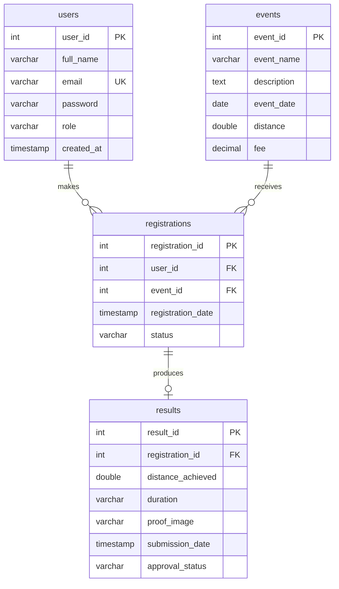

# Uni-Run: Marathon & Virtual Run Coordinator

Uni-Run is a web based system for managing marathon and virtual run events.
Participants browse events, register online, submit their race results with a
proof image, follow the approval status of each submission, and download a
finisher certificate once a result is approved. Administrators manage the event
catalogue, review submitted results, oversee participant accounts and export
reports.

## Technologies Used

- Java 8
- JSP and Servlets (Java EE 7 Web Profile, Servlet 3.1)
- MySQL / MariaDB
- Apache Tomcat 8.0
- NetBeans IDE 8.2 (Ant based web project)
- HTML, CSS, Bootstrap 5
- JUnit 4 for unit testing

Everything the pages need is stored in the project. No stylesheet, script or
font is fetched from the internet, so the system looks and behaves the same
with the network switched off.

## Features

### Visitor

- Home page describing the system
- Browse all available events, with instant search
- Public race leaderboard
- Register an account, then log in

### Participant

- Personal dashboard with live totals for events joined, results sent,
  approved and pending
- Join an event, with duplicate registration prevented
- Submit a race result with distance, duration and a proof image
- Correct and resubmit a result that an administrator rejected
- Track the approval status of every submission
- Download a printable finisher certificate for approved results

### Administrator

- Separate admin dashboard, reached automatically on login
- System overview: events, participants, registrations, pending and approved
  results, plus a registrations per event chart
- Create, update and delete events
- Approve or reject participant result submissions
- View every participant with their activity, and remove accounts
- Export the participant list and the results list as CSV

### Throughout

- Light and dark theme, remembered between visits
- Command palette on `Ctrl+K` for searching pages and actions
- Instant client side filtering on every long table

## Database Design



A participant makes many registrations and an event receives many
registrations, so `registrations` resolves the many to many relationship
between them. Each registration produces at most one result.

### Notable columns

| Column | Notes |
|---|---|
| `users.password` | SHA-256 hash of the password. Plain text is never stored. |
| `users.role` | Either `admin` or `participant`. Decides which dashboard the user reaches on login. |
| `registrations.status` | Set to `Registered` when a participant joins an event. |
| `results.registration_id` | Unique, so a registration can hold only one result. |
| `results.proof_image` | Generated filename of the uploaded image, stored outside the application. |
| `results.approval_status` | `Pending`, `Approved` or `Rejected`. A rejected result may be corrected and resubmitted, which returns it to `Pending`. |

### Constraints

| Constraint | Table | Purpose |
|---|---|---|
| `uq_users_email` | users | One account per email address |
| `uq_registration_user_event` | registrations | A participant cannot join the same event twice |
| `uq_results_registration` | results | One result per registration |
| `fk_registrations_user` | registrations | Cascades on user deletion |
| `fk_registrations_event` | registrations | Cascades on event deletion |
| `fk_results_registration` | results | Cascades on registration deletion |

All three foreign keys are declared `ON DELETE CASCADE`, so removing an event
or a participant also removes the registrations and results beneath it and no
orphan rows are left behind.

> **Full database documentation is in [DATABASE.md](DATABASE.md)**: a complete
> data dictionary for every column, the functional dependencies, a normalisation
> analysis through 1NF to BCNF, the design trade-offs behind each choice, and
> the known limitations.

## Database Setup

1. Start MySQL from the XAMPP control panel.
2. Open phpMyAdmin, or the MySQL command line.
3. Import `unirun_db.sql`.

The script creates the `unirun_db` database, the four tables and the sample
data in one step. It begins with `DROP DATABASE IF EXISTS`, so running it again
gives a clean database.

From the command line:

```bash
mysql -u root < unirun_db.sql
```

## Database Connection

Connection settings are in `src/java/util/DBConnection.java`:

```java
URL:      jdbc:mysql://localhost:3306/unirun_db
Username: root
Password: (blank)
```

These are the XAMPP defaults. Change them there if your MySQL differs.

## Demo Accounts

Passwords are stored as SHA-256 hashes. The plain text is listed here only so
the system can be demonstrated.

| Role | Email | Password |
|---|---|---|
| Administrator | admin@unirun.com | admin123 |
| Participant | ali@email.com | ali123 |
| Participant | aisya@gmail.com | aisya123 |
| Participant | nina@gmail.com | nina123 |
| Participant | ahmad@gmail.com | ahmad123 |
| Participant | farah@gmail.com | farah123 |
| Participant | daniel@gmail.com | daniel123 |
| Participant | siti@gmail.com | siti123 |
| Participant | rajesh@gmail.com | rajesh123 |

Logging in as the administrator goes to the admin dashboard; logging in as a
participant goes to the participant dashboard.

### What the sample data contains

| | Count |
|---|---|
| Events | 8, running from August to November 2026 |
| Participants | 8, plus one administrator |
| Registrations | 24, spread unevenly so the dashboard chart is meaningful |
| Results | 17 — 14 approved, 2 awaiting review, 1 rejected |

The distances range from a 5 km campus run to a full 42.2 km marathon, and the
fees from free to RM80, so the events list shows real variety rather than three
near identical rows.

The result mix is deliberate. **Campus Sunrise 5K** has six approved finishers,
which fills the leaderboard podium with gold, silver and bronze places. Two
results are left **Pending** so the approval screen has something waiting when
you open it, and one is **Rejected** so the correction and resubmission flow can
be demonstrated without having to reject something first.

## How to Run the Project

1. Start **MySQL** in XAMPP and import `unirun_db.sql`.
2. Open the project folder in **NetBeans**.
3. Confirm **Apache Tomcat 8.0** is the server for the project.
4. Run **Clean and Build**, then **Run**.

Home page:

```text
http://localhost:8084/UniRunSystem_Copy/
```

The context path follows the WAR name in `nbproject/project.properties`, and
the port follows your Tomcat setup.

### Where uploaded images are kept

Proof images are written to a `unirun-uploads` folder beside the running Tomcat
instance, not inside the deployed application. The server deletes and recreates
the application folder on every redeployment, so images stored inside it would
disappear each time the project was rebuilt. Because the folder is outside the
application it cannot be reached by URL, so images are served by
`ProofImageServlet`, which checks who is asking before returning one.

## Testing

Unit tests cover the logic that does not need a database or a running server:
password hashing, HTML escaping and upload name validation.

Run them in NetBeans with **Run > Test Project**, or from the command line with
Ant:

```bash
ant test
```

| Test class | Tests | Covers |
|---|---|---|
| `PasswordUtilTest` | 13 | Hashing, verification, null handling, and a check against the published SHA-256 value for a known input |
| `WebTest` | 10 | Escaping of `< > & " '`, script and attribute injection payloads |
| `UploadStoreTest` | 10 | Accepting generated names, rejecting path traversal, executable extensions and double extensions |

All 33 tests pass.

## Project Structure

```text
UniRunSystem/
├── lib/                                JARs used by the project
│   ├── mysql-connector-j-9.7.0.jar
│   ├── junit-4.12.jar
│   └── hamcrest-core-1.3.jar
├── nbproject/                          NetBeans project metadata
├── src/java/
│   ├── controller/                     Servlets
│   │   ├── AddEventServlet.java
│   │   ├── ApproveResultServlet.java
│   │   ├── DeleteEventServlet.java
│   │   ├── DeleteParticipantServlet.java
│   │   ├── EditEventServlet.java
│   │   ├── ExportServlet.java          CSV reports
│   │   ├── LoginServlet.java
│   │   ├── LogoutServlet.java
│   │   ├── ProofImageServlet.java      Serves proof images with a permission check
│   │   ├── RegisterEventServlet.java
│   │   ├── RegisterServlet.java
│   │   └── ResultSubmissionServlet.java
│   └── util/
│       ├── DBConnection.java           Supplies JDBC connections
│       ├── PasswordUtil.java           Password hashing and checking
│       ├── UploadStore.java            Upload location and name validation
│       └── Web.java                    HTML escaping helper
├── test/util/                          JUnit tests
│   ├── PasswordUtilTest.java
│   ├── UploadStoreTest.java
│   └── WebTest.java
├── web/
│   ├── css/
│   │   ├── bootstrap.min.css           Held locally, so no internet is needed
│   │   ├── style.css                   Original site styling
│   │   └── theme.css                   Shared theme, dark mode, animation, print
│   ├── js/
│   │   └── app.js                      Theme switch, command palette, filtering
│   ├── WEB-INF/
│   │   ├── jspf/
│   │   │   ├── adminGuard.jspf         Access check for admin pages
│   │   │   └── participantGuard.jspf   Access check for participant pages
│   │   └── web.xml
│   ├── index.jsp          login.jsp            register.jsp
│   ├── events.jsp         leaderboard.jsp      dashboard.jsp
│   ├── submitResult.jsp   viewResultStatus.jsp certificate.jsp
│   ├── adminDashboard.jsp manageEvents.jsp     manageParticipants.jsp
│   └── addEvent.jsp       editEvent.jsp        approveResults.jsp
├── Uni-Run-Marathon-Virtual-Run-Coordinator/
│   └── Storyboard/                     Interface storyboard for the report
├── build.xml
├── unirun_db.sql                       Database setup script
└── README.md
```

## Security Notes

- **Password hashing.** Passwords are hashed with SHA-256 by
  `util.PasswordUtil` before storage. The database never holds a plain text
  password, and login compares hashes rather than decrypting anything. The
  comparison runs in constant time so its duration reveals nothing.
- **Access control.** Every page needing a login includes a guard from
  `web/WEB-INF/jspf/`, and every servlet that changes data checks the session
  and the role again on the server. Opening an admin URL directly without
  signing in redirects to the login page.
- **SQL injection.** Every query uses a `PreparedStatement` with bound
  parameters. No SQL is assembled from user input.
- **Cross site scripting.** Values from the database or from a request are
  escaped with `util.Web.esc` before being written into a page.
- **File uploads.** Only JPG and PNG are accepted, checked by extension and by
  content type. The stored name is generated by the server, so nothing the user
  types can influence where the file is written, and any name that does not
  match that pattern is refused before it becomes a path.
- **Ownership checks.** A participant can only submit a result against their
  own registration, and can only view their own registrations, results, proof
  images and certificates. Changing an id in the address bar does not expose
  another person's data.
- **State changing requests use POST.** Approving, rejecting and deleting are
  submitted as forms rather than links that could be followed accidentally.
- **Administrator accounts are protected.** The delete statement for
  participants also requires `role = 'participant'`, so an administrator row
  cannot be removed even if its id is supplied by hand.
- **CSV injection.** Exported fields beginning with `=`, `+`, `-` or `@` are
  prefixed, so stored text cannot run as a formula when the file is opened in a
  spreadsheet.
- **Session handling.** The session is replaced on login, and sessions expire
  after 30 minutes of inactivity.
- **Error handling.** Failures are written to the Tomcat log. Visitors see a
  short message rather than a database error or a stack trace.

## Accessibility

- Every animation is disabled for visitors whose system requests reduced
  motion, while the layout and colours stay intact.
- Keyboard focus is always visible, and the command palette is fully operable
  from the keyboard.
- Counting figures and the theme choice are progressive enhancements: the
  correct values are present in the HTML even when scripting is unavailable.

## Possible Future Work

- Per user salts and a slow hashing algorithm such as bcrypt, so that identical
  passwords do not produce identical hashes and brute forcing is expensive.
- Passwordless sign in with WebAuthn, using Windows Hello or Touch ID.
- An event lifecycle with an open and closed state and a registration deadline.
- Email notification when a result is approved or rejected.
- Installable progressive web app with an offline shell.

## Group Task Division

- Khairil : Project setup, database, GitHub, integration, homepage, DBConnection
- Nina : Login, register, logout, session handling
- Arif : Event listing, event details, event registration
- Naim : Participant dashboard, registration history, result submission
- Nazim : Admin dashboard, manage events, manage participants, reports

## Author

Muhammad Khairil Ilman Bin Ahmad Nazari
